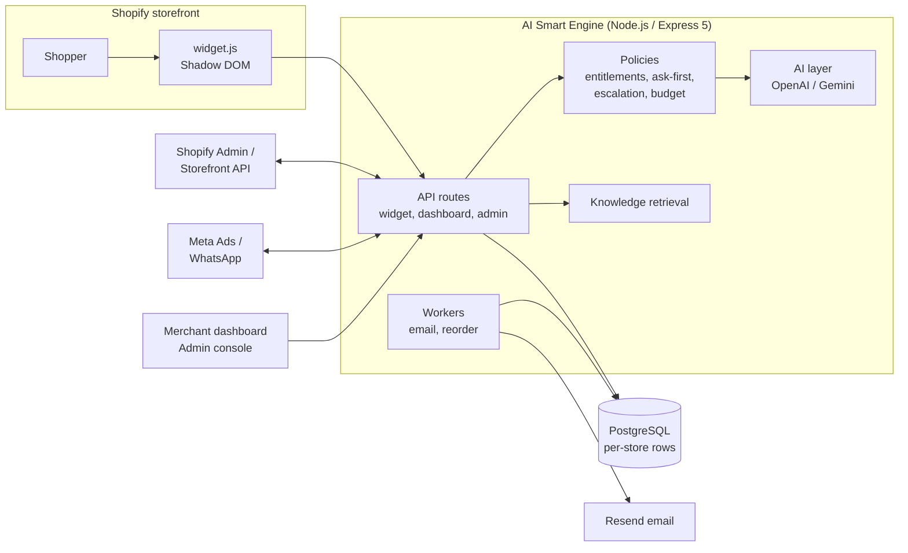
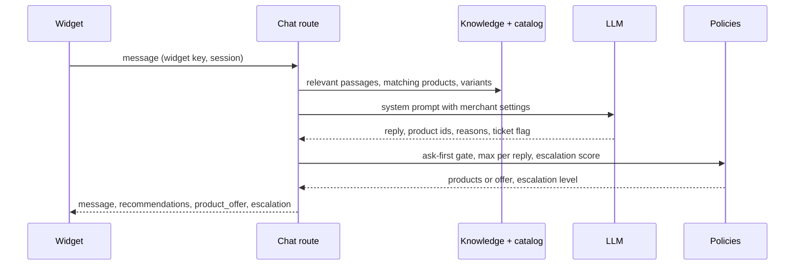
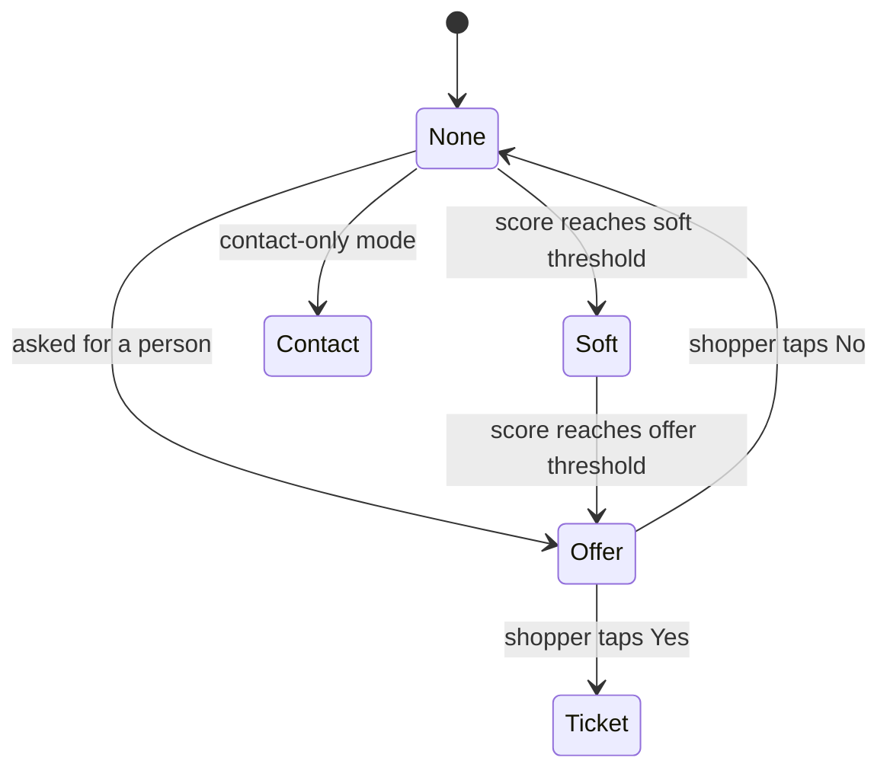
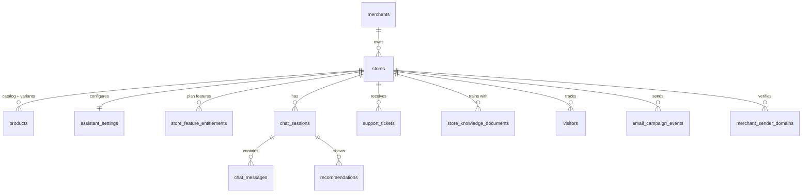
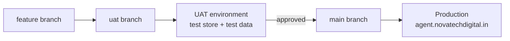

# AI Smart Engine

### Multi-tenant AI shopping assistant and growth platform for Shopify stores

[]()
[]()
[]()
[]()
[]()

AI Smart Engine puts a consultative AI shopping assistant on a merchant's Shopify storefront and gives the merchant one dashboard for support, analytics, email and WhatsApp automation, ad insights and an AI business analyst. One deployment serves many stores; every record is isolated per store, and each feature is switched on per store by the platform admin.

Built and operated by **Novatech Digital** (platform domain `novatechdigital.in`).

---

## Contents

1. [What it does](#what-it-does)
2. [Architecture](#architecture)
3. [How a storefront chat works](#how-a-storefront-chat-works)
4. [Feature modules](#feature-modules)
5. [Merchant settings that shape the assistant](#merchant-settings-that-shape-the-assistant)
6. [Data model](#data-model)
7. [Shopify connection and permissions](#shopify-connection-and-permissions)
8. [Email sending](#email-sending)
9. [Security and compliance](#security-and-compliance)
10. [Project structure](#project-structure)
11. [API map](#api-map)
12. [Environment variables](#environment-variables)
13. [Local development and tests](#local-development-and-tests)
14. [Deployment (Railway)](#deployment-railway)
15. [Operational notes](#operational-notes)

---

## What it does

| Area | Highlights |
| --- | --- |
| Storefront assistant | Shadow-DOM widget; consultative answers grounded in the store's catalog, policies and uploaded knowledge; "Ask first" product suggestions; product cards with in-chat variant pickers (pack size, colour, size); compact and links-only styles; tappable links; replies in the shopper's language |
| Support | Tickets with auto-triage (category, sentiment, priority), reply SLA countdown, receipt and merchant alert emails, reply macros and AI drafts; three human-support modes (Contact only, Smart, Instant) |
| Knowledge | PDF/TXT/MD/CSV/XLSX uploads parsed on the server, website scan, relevance-ranked retrieval per question |
| Growth | Email recovery (consented), WhatsApp (Meta Cloud API / WATI), smart reorder reminders, AI ad creative studio, Meta Ads manager, Ads Explorer, multi-touch attribution |
| Analytics | Live Pulse and funnel, overview KPIs, Growth Copilot recommendations, leads and consent ledger |
| Merchant AI agent | Answers business questions from live Shopify and Meta data with tool calls; document verdicts; English by default |
| Platform | Per-store feature entitlements, AI budget guard, encrypted credentials, signed webhooks, admin console |

---

## Architecture



- **Provider abstractions:** AI (`IAiProvider`: OpenAI, Gemini, mock, auto), email (`IEmailProvider`: Resend, fake), Shopify (`IShopifyCatalogAdapter`: live, fake), WhatsApp (Meta, WATI, mock). Tests and local runs use the fake/mock providers.
- **Server-side rules:** feature entitlements, the "Ask first" recommendation policy and the escalation decision all run on the server, so the widget and the model cannot bypass them.

---

## How a storefront chat works



- **Ask first:** products are held back until the shopper says yes or explicitly asks ("show me", "recommend", "which should I buy"); the reply carries Yes/No chips instead.
- **Escalation:** a frustration score (asked for a human, anger, damaged item or payment problem, repeated question, AI could not answer, long chat) becomes `none`, `soft` (a "Still stuck?" chip), `offer` (Yes/No ticket) or `contact` (support email and WhatsApp).
- **Scrolling:** a new reply opens at its first line; the shopper scrolls to products, with an "options below" pill as a pointer.



---

## Feature modules

Each module is gated by a feature key in `store_feature_entitlements` (`src/modules/entitlements`). A disabled feature hides its dashboard tab, and its API returns `403 FEATURE_DISABLED` with a clear message.

| Feature key | Dashboard tab | Module | What it does |
| --- | --- | --- | --- |
| `growth_copilot` | Growth Copilot | `growth` | Data-grounded growth actions |
| `overview` | Overview | `analytics` | KPIs across chats, leads, carts, purchases, email, AI usage |
| `live_pulse`, `funnel` | Live Pulse & Funnel | `analytics`, `events` | Live shoppers, visit-to-purchase funnel |
| `widget` | My Agent, Widget Settings | `merchant`, `knowledge` | Assistant persona, knowledge, recommendations, widget look |
| `leads` | Leads & Opt-ins | `visitor` | Captured contacts and consent ledger |
| `support_tickets` | Support Tickets | `support_tickets` | Tickets, triage, SLA, escalation modes (default off for new stores) |
| `catalogue` | Shopify Catalog | `shopify_health`, providers | Catalog, variants, connection health, permission check |
| `ad_creative` | Ad Creative Studio | `ad_creatives` | AI ad copy and images |
| `whatsapp` | WhatsApp Growth | `whatsapp` | Conversations, consents, recovery messages |
| `email_automation` | Email Automation | `email` | Recovery sequences, sending identity, sender domains |
| `smart_reorder` | Smart Reorder | `replenishment` | Replenishment reminders and cart permalinks |
| `ad_intelligence` | Ad Intelligence | `attribution` | Multi-touch attribution and ROAS |
| `meta_ads`, `ads_explorer` | Meta Ads, Ads Explorer | `meta_ads` | Campaign performance, creative library |
| `ai_agent_chat` | AI Agent | `ai_agent` | Merchant analyst with tools and document verdicts |
| `ai_store_analysis` | (Overview audit) | `ai` | Store health audit |

---

## Merchant settings that shape the assistant

Set in **My Agent** and stored in `assistant_settings`.

| Setting | Values | Default |
| --- | --- | --- |
| Product suggestions | `ask_first`, `direct` | `ask_first` |
| Display style | `cards`, `compact`, `links` (links never show Add to cart) | `cards` |
| Products per reply | 1 to 3 | 3 |
| Show variants / "Why this fits" | on, off | on |
| Human support mode | `contact_only`, `smart`, `instant` ("Need Help?" button only in Instant) | `smart` |
| Smart sensitivity | `early`, `balanced`, `late` | `balanced` |
| Ticket SLA | 2 hours to 2 business days | 24 hours |
| Knowledge | Documents (up to 25 per store, 60k characters each), website scan, free text | — |

---

## Data model

The core tables (37 migrations in `migrations/`, applied automatically on start):



Every tenant table carries `store_id`, and every query is scoped by it.

---

## Shopify connection and permissions

Merchants connect through a **Shopify custom app** and paste the Admin API and Storefront API tokens in onboarding. Tokens are encrypted (AES-256-GCM) before storage. All permissions are **read-only**; the canonical list lives in `src/modules/shopify_health/shopify-scopes.ts` and is served at `GET /api/v1/shopify/required-scopes` for the onboarding and reconnect screens.

| Level | Admin API scopes |
| --- | --- |
| Required | `read_products`, `read_orders`, `read_customers`, `read_inventory` |
| Recommended | `read_fulfillments`, `read_checkouts`, `read_discounts`, `read_price_rules`, `read_shipping`, `read_locations`, `read_content`, `read_online_store_pages`, `read_marketing_events`, `read_reports`, `read_analytics`, `read_returns` |
| Optional | `read_all_orders` |

Storefront API: `unauthenticated_read_product_listings`, `unauthenticated_read_product_inventory`, `unauthenticated_read_product_tags`, `unauthenticated_read_content`.

The health check (`Shopify Catalog` tab) reads the token's granted scopes from `/admin/oauth/access_scopes.json` in one call, marks the connection degraded only when a required scope is missing, and lists recommended ones to add. Catalog sync pulls up to 25 variants per product with their options, prices, stock and images, and retries when Shopify throttles.

**Installing the widget** (Online Store → Themes → Edit code → `layout/theme.liquid`, before `</body>`):

```html
<script src="https://agent.novatechdigital.in/widget.js" data-widget-key="STORE_WIDGET_KEY" defer></script>
```

The widget calls the API on the same origin as the script, so no separate API URL is needed.

---

## Email sending

- One platform Resend account sends for every store. Default sender: `"<Store name>" <notifications@novatechdigital.in>` with Reply-To set to the store's support email.
- A store can verify its own domain in **Email Automation** (DKIM, SPF, recommended DMARC shown with copy buttons); mail then comes from that domain.
- Outside `NODE_ENV=production`, every recipient is diverted to Resend's test inbox (`delivered@resend.dev`) so local and test runs never email real customers.

---

## Security and compliance

- **Tenant isolation:** store-scoped queries, store-access middleware on every dashboard route, onboarding requests can only touch the invited merchant's own store.
- **Entitlements:** features are enforced by router-level middleware and in the merchant AI agent's tool list.
- **Webhooks:** Shopify HMAC (timing-safe), Resend Svix signatures when `RESEND_WEBHOOK_SECRET` is set, WhatsApp `X-Hub-Signature-256` when an app secret is configured.
- **Widget safety:** all AI and merchant text is escaped; only `http(s)` links are rendered; per-store browser storage.
- **Consent:** marketing email and WhatsApp only with an opt-in record; unsubscribes, bounces and complaints are suppressed.
- **AI budget guard:** usage is metered per store in `ai_usage_ledger`; the assistant falls back gracefully at the monthly stop limit.
- **Input limits:** chat messages capped at 2,000 characters; ticket fields trimmed; test-only endpoints disabled in production.

---

## Project structure

```text
src/
  config/            env schema (zod)
  database/          client, migrator, types
  modules/           feature modules (chat, knowledge, support_tickets, email, whatsapp,
                     replenishment, attribution, meta_ads, ai_agent, entitlements, ...)
  providers/         ai/ (OpenAI, Gemini, prompts), email/, shopify/ (adapters, variants), whatsapp/
  server/            app.ts, routes/, middlewares/, server.ts, worker.ts
  public/            widget.js, dashboard/, admin/, onboarding/, common/
migrations/          SQL migrations 001 to 037
tests/               unit/ and integration/ (vitest, pg-mem)
```

---

## API map

| Prefix | Audience | Examples |
| --- | --- | --- |
| `/api/v1/widget/*` | Storefront widget (widget key + origin check) | `config`, `session`, `chat/message`, `chat/history`, `consent`, `tickets` |
| `/api/v1/dashboard/:storeId/*` | Merchant dashboard (JWT + store access + feature gate) | `agent`, `agent/knowledge/documents`, `tickets`, `email`, `whatsapp`, `replenishment`, `attribution`, `meta-ads`, `ai-agent`, `shopify/health` |
| `/api/v1/admin/*` | Platform admins | merchants, invites, stores, feature entitlements |
| `/api/v1/onboarding/*` | Invited merchants (onboarding token) | wizard steps 1 to 6, sender domains |
| `/api/v1/shopify/*` | Shopify | `webhooks/orders`, `webhooks/products`, `required-scopes` |
| `/api/v1/webhooks/*` | Providers | `resend`, `whatsapp`, `whatsapp/wati/:storeId` |
| `/health`, `/api/v1/health` | Monitoring | database, AI, email and Shopify mode |

---

## Environment variables

| Variable | Purpose | Notes |
| --- | --- | --- |
| `NODE_ENV` | Runtime mode | `production` on the live service (real email delivery, test endpoints off) |
| `PORT`, `BASE_URL` | HTTP port, public URL for links in emails | |
| `DATABASE_URL` | PostgreSQL | `mock` uses the in-memory database |
| `ENCRYPTION_KEY` | AES-256-GCM key for stored tokens | 32 random bytes as hex; must be set in production |
| `SESSION_SECRET`, `UNSUBSCRIBE_SIGNING_SECRET` | Session and unsubscribe-link signing | |
| `AI_PROVIDER` | `openai`, `gemini`, `auto`, `mock` | |
| `OPENAI_API_KEY`, `OPENAI_MODEL`, `GEMINI_API_KEY`, `GEMINI_MODEL` | AI providers | |
| `AI_MONTHLY_BUDGET_WARN_USD`, `AI_MONTHLY_BUDGET_STOP_USD` | Per-store AI budget | |
| `SHOPIFY_ADAPTER_MODE`, `SHOPIFY_API_VERSION`, `SHOPIFY_CLIENT_SECRET` | Shopify adapter and webhook HMAC | |
| `EMAIL_PROVIDER_MODE`, `RESEND_API_KEY` (or `EMAIL_API_KEY`) | Email provider | `resend` in production |
| `EMAIL_FROM_ADDRESS`, `EMAIL_FROM_NAME` | Platform default sender | `notifications@novatechdigital.in` |
| `RESEND_WEBHOOK_SECRET` | Verifies Resend webhooks | recommended |
| `WHATSAPP_APP_SECRET`, `WHATSAPP_WEBHOOK_VERIFY_TOKEN`, `WHATSAPP_PROVIDER_MODE` | WhatsApp webhooks | |

---

## Local development and tests

```bash
npm install
cp .env.example .env          # mock adapters by default
npm test                      # vitest + pg-mem, no database needed
npm run build                 # TypeScript compile
npm run dev                   # build and start on http://localhost:3000
```

To run locally without touching any live database or sending real email:

```bash
DATABASE_URL=mock NODE_ENV=development AI_PROVIDER=mock OPENAI_API_KEY=mock \
EMAIL_PROVIDER_MODE=fake SHOPIFY_ADAPTER_MODE=fake PORT=3900 node dist/src/server/server.js
```

Then open `/dashboard/index.html` (seed login `merchantA@store.com` / `password123`) and `/demo.html` for the widget.

---

## Deployment (Railway)

- `railway.json` runs `npm run start` with `/api/v1/health` as the health check; `nixpacks.toml` installs dev dependencies for the TypeScript build even when `NODE_ENV=production`.
- Pushing to `main` deploys production. A separate `uat` environment (own database, `uat` branch, test Shopify store) is recommended before releases.



- Migrations run on start; a failed deploy can be rolled back from Railway → Deployments → Redeploy.
- Optional worker service: same repo, start command `npm run worker`.

---

## Operational notes

- After a deploy that changes the catalog shape, merchants press **Shopify Catalog → Sync** to load variants.
- If Shopify is missing a permission, the Shopify Catalog tab lists it; the merchant ticks it in the custom app and pastes a regenerated token.
- Support tickets are off for new stores until an admin enables them; such stores run in Contact-only mode.

## License

ISC
