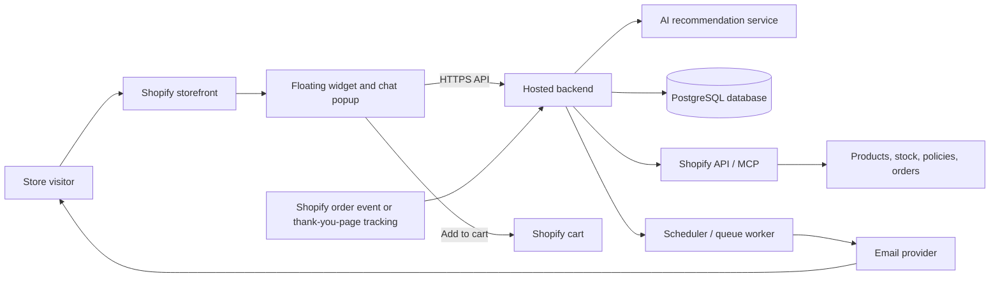
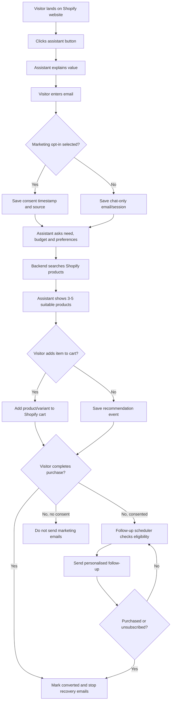

# AI Shopping Assistant for Shopify Stores

**Document status:** MVP system design  
**Target market:** UK Shopify merchants  
**Integration model:** Custom-hosted widget embedded manually in a Shopify theme (not a Shopify app in MVP)

## Locked MVP Decisions

| Decision | Selected approach |
|---|---|
| Hosting | Railway |
| Main AI | OpenAI API |
| Voice | Not in Phase 1; architecture remains ready for a later ElevenLabs voice layer. |
| Store integration | Manual Shopify theme snippet; no Shopify app in Phase 1. |
| Data model | One multi-tenant platform with strict `store_id` isolation. |
| Monthly test budget | Railway: $10; OpenAI API: $15; total planned platform budget: $25/month, excluding email-provider upgrades. |

## 1. Project Summary

This system adds a floating **"Ask our shopping assistant"** button to a Shopify website. A visitor can open the chat, share their requirements, receive product recommendations, add an item to their Shopify cart, and—only if they separately opt in—receive follow-up emails if they do not purchase.

The solution is hosted by us. Shopify only loads a small widget script. Shopify credentials and AI tools stay securely on our server.

## 2. Goals

- Help visitors choose the right product through a simple conversation.
- Turn anonymous visitors into consented leads.
- Recommend only products actually available in the connected Shopify store.
- Track recommendation clicks, cart additions, and purchases.
- Send helpful, personalised recovery emails to opted-in users who have not purchased.
- Make each merchant's setup repeatable through a merchant onboarding form.

## 3. Non-Goals for the MVP

- A public Shopify App Store app.
- A full multi-user merchant analytics dashboard.
- SMS or WhatsApp marketing.
- Automatic discount-code creation.
- Handling highly sensitive personal information.

## 4. Main Users

| User | What they do |
|---|---|
| Store visitor | Uses the assistant, sees products, adds items to cart, optionally consents to email. |
| Merchant | Adds the widget code, completes setup details, and supplies Shopify/email access. |
| Admin (our team) | Connects the store, monitors integrations, and manages issues. |

## 5. Architecture



### Component Responsibilities

| Component | Responsibility |
|---|---|
| Widget | Displays the button/chat; collects answers and consent; renders product cards; sends events to backend. |
| Backend API | Validates requests, creates sessions, calls AI, connects to Shopify, saves data, and provides widget configuration. |
| AI recommendation service | Converts user needs into safe, relevant product searches and concise recommendations. |
| Shopify connection | Retrieves live products, prices, variants, stock, policies and (where authorised) order status. |
| Database | Stores merchant settings, encrypted credentials, sessions, leads, consent records, event history and email status. |
| Queue/scheduler | Finds eligible follow-ups and sends them at the configured interval. |
| Email provider | Delivers branded emails, handles bounces, and provides unsubscribe links. |

## 6. Visitor Flow Diagram



## 7. Merchant Onboarding Flow

```mermaid
flowchart LR
    A[Merchant opens setup form] --> B[Enters store, brand and assistant details]
    B --> C[Provides Shopify and email connection details]
    C --> D[System validates and encrypts credentials]
    D --> E[Create merchant + store profile]
    E --> F[Generate unique widget snippet]
    F --> G[Merchant pastes snippet into Shopify theme]
    G --> H[Widget loads store configuration]
    H --> I[Merchant tests assistant]
    I --> J[Go live]
```



## 8. Data Design

### Core Tables

| Table | Key fields | Purpose |
|---|---|---|
| `merchants` | id, name, contact_email | Merchant/business record. |
| `stores` | id, merchant_id, shop_domain, status | One Shopify store configuration. |
| `store_credentials` | store_id, encrypted_admin_token, encrypted_storefront_token | Encrypted Shopify access only; never sent to browser. |
| `widget_settings` | store_id, button_text, position, colours, greeting | Controls the widget appearance and tone. |
| `assistant_settings` | store_id, assistant_name, allowed_topics, support_contact | Controls assistant behaviour. |
| `store_policies` | store_id, delivery, returns, faq | Trusted policy content for responses. |
| `visitors` | id, store_id, anonymous_id, email | Visitor identity; email can be optional until submitted. |
| `marketing_consents` | visitor_id, opted_in, captured_at, source, version | Proof of marketing preference. |
| `chat_sessions` | id, visitor_id, started_at, summary | Conversation record. |
| `events` | store_id, visitor_id, type, payload, created_at | Page/product/cart/purchase activity. |
| `recommendations` | session_id, product_id, variant_id, reason | Products shown by assistant. |
| `email_campaign_events` | visitor_id, campaign_type, sent_at, status | Prevents duplicate emails and records delivery status. |
| `suppression_list` | email, reason, created_at | Unsubscribed/bounced recipients; never email again. |

### Important Event Types

```text
widget_opened
email_submitted
marketing_opted_in
chat_message
product_recommended
product_clicked
add_to_cart
checkout_started
purchase_completed
email_sent
email_unsubscribed
```

## 9. Email Automation Rules

Default MVP sequence:

| Trigger | Email | Safeguard |
|---|---|---|
| Chat ends without purchase | Day 0: product summary | Only send when opted in. |
| No purchase after 3 days | Day 3: tailored reminder/alternatives | Skip if another email was sent recently. |
| No purchase after 7 days | Day 7: final helpful follow-up | Maximum 3 recovery emails per journey. |

Before every send, the worker must verify:

```text
marketing opt-in is true
AND email is not suppressed
AND no completed purchase exists after the session
AND frequency limit is respected
AND the store is active
```

Each message needs clear sender identity, an unsubscribe link, and a valid contact address. The consent record must include the wording/version shown to the visitor, time, store and capture source.

## 10. Security and Privacy Requirements

- Keep Shopify and email provider tokens only on the backend, encrypted at rest.
- Never expose API tokens, MCP credentials, or admin data in the widget code.
- Use HTTPS for widget, API and all webhooks.
- Authenticate the widget with its store ID plus a signed/short-lived session token.
- Validate the Shopify domain against the configured store before serving data.
- Restrict AI to product data and approved policies; do not let it invent prices, stock, delivery promises or returns rules.
- Maintain consent records, unsubscribe records and data-deletion procedures.
- Do not run non-essential tracking until the store's applicable consent preference permits it.
- Limit database access by role and keep audit logs for sensitive changes.

> UK note: marketing emails must be sent only when the visitor has valid marketing consent (unless a correctly implemented legal exception applies). In this MVP, use a separate unticked opt-in checkbox and an unsubscribe link in every marketing email.

## 11. Recommended Tech Stack

| Layer | Recommended choice | Why |
|---|---|---|
| Widget | TypeScript + React, bundled as a lightweight embed | Fast UI development and reusable popup component. |
| Widget isolation | Shadow DOM | Reduces clashes with Shopify theme CSS. |
| Backend | Node.js + Next.js or NestJS | One TypeScript language across frontend and server. |
| AI | OpenAI Responses/Agent service with Shopify tools/MCP | Product-aware conversation and controlled tool calls. |
| Shopify data | Storefront API for storefront data; Admin API/MCP server-side for trusted data | Supports live product search and protected backend operations. |
| Database | PostgreSQL | Reliable relational storage for consent, events and multi-store data. |
| ORM | Prisma or Drizzle | Typed database access and migrations. |
| Queue/scheduler | Railway Cron + PostgreSQL job table | Reliable delayed email jobs without adding Redis in the first MVP. |
| Email | Postmark or Resend | Transactional delivery, domain verification and unsubscribe support. |
| Hosting | Railway: web/API service + PostgreSQL + worker service | Keeps the MVP infrastructure in one place. |
| Observability | Sentry + structured logs | Finds errors in widget, API and emails. |

## 12. SDLC Plan

### Phase 1: Discovery and Requirement Freeze

**Output:** approved scope, merchant input checklist, consent copy and success metrics.

- Confirm assistant's job, tone, question flow and escalation path.
- Confirm Shopify access method and email provider.
- Decide product attributes: category, budget, size, colour, occasion, etc.
- Confirm the UK consent wording, privacy policy and email frequency.
- Define success: chat-start rate, lead rate, add-to-cart rate and purchase conversion.

### Phase 2: UX/Wireframes

**Output:** approved screens and chat flow.

- Floating button states.
- Welcome screen and value message.
- Email/consent screen.
- Question flow and product recommendation cards.
- Cart confirmation, fallback and support handoff states.
- Merchant setup form.

### Phase 3: Foundation

**Output:** deployable backend and secure data model.

- Create project repositories/environments.
- Build database schema and migrations.
- Add encrypted configuration and secrets management.
- Build merchant/store setup APIs.
- Implement Shopify product and policy sync/search.

### Phase 4: Widget and Assistant

**Output:** working widget in a test Shopify store.

- Create lightweight embed script and Shadow DOM popup.
- Implement session creation, chat streaming and user-answer capture.
- Connect assistant to safe Shopify product search tools.
- Render product cards and add-to-cart action.
- Add brand configuration support.

### Phase 5: Tracking and Email Recovery

**Output:** end-to-end abandoned journey works.

- Capture widget, recommendation and cart events.
- Configure reliable purchase-completion signal.
- Implement consent and suppression checks.
- Add email templates, scheduler, retries and unsubscribe handling.

### Phase 6: QA and Security Review

**Output:** release candidate.

- Test on desktop/mobile and at least two Shopify themes.
- Test out-of-stock, price change, API failure and slow-network states.
- Test no-consent, opt-out, bounce and post-purchase email-stop cases.
- Review token security, CORS, rate limits and data deletion.

### Phase 7: Pilot Launch and Measure

**Output:** live single-merchant pilot and report.

- Add widget to one controlled merchant store.
- Monitor errors, load time, conversation quality and email delivery.
- Review weekly conversion data and improve questions/recommendations.
- Decide whether to build the merchant dashboard and Shopify app path.

## 13. Phase 1 Build Scope (Do This Now)

The first implementation must create a working, testable, single-platform MVP. It must support multiple stores internally, but only needs one test Shopify store for launch testing.

### Build Now

- A merchant setup form that creates a merchant and a store profile.
- Secure Railway backend with PostgreSQL database.
- A unique, lightweight JavaScript widget snippet per store.
- Floating assistant button and responsive chat popup, isolated from Shopify theme CSS.
- Email capture, optional phone field, separate unticked marketing-consent checkbox and privacy-policy link.
- OpenAI-powered chat that asks focused shopping questions and recommends 3-5 products from the correct store only.
- Shopify product lookup and product cards, with a safe product-link fallback if Add to Cart cannot work in a theme.
- Event tracking for widget opened, email submitted, consent, recommendation shown/clicked and Add to Cart.
- Purchase-status integration designed behind an adapter; implement the best authorised signal available for the test store.
- Email job table, scheduled processing, opt-in/suppression checks and one test follow-up email template.
- Per-store usage counters and application-level OpenAI budget guard.

### Do Not Build Yet

- Public Shopify App Store installation.
- Merchant login/dashboard.
- SMS, WhatsApp, voice agent or ElevenLabs integration.
- Discounts/coupons, complex analytics, billing/subscriptions or a visual workflow builder.
- A separate database, deployment, or agent for each merchant.

## 14. Cost Plan and Guardrails

### Planned Test Budget

| Cost | Monthly budget | Rule |
|---|---:|---|
| Railway | $10 | Runs the API, PostgreSQL and scheduled worker. Monitor Railway usage weekly. |
| OpenAI API | $15 | Prepaid credit balance; use a dedicated test project. |
| Email provider | $0 initially | Use its free tier for test emails; upgrade only when real volumes need it. |
| Domain | $0 in this plan | Use the Railway-generated domain during testing. |
| **Total planned budget** | **$25/month** | Excludes taxes and any provider overage caused by changing the limits. |

### OpenAI Cost Controls

- Create a dedicated project named `shopify-assistant-test`; never use a personal/default production key.
- Start with a low-cost chat model and set `max_output_tokens` to a concise reply length.
- Do product filtering in code first; send only the top relevant products to the model.
- Store `ai_input_tokens`, `ai_output_tokens` and estimated cost for every request.
- Warn at $10 of estimated monthly use, and reject new non-essential AI chats at $14.
- Keep API prepaid credit at $15 and disable auto-recharge during testing.
- Use mock AI/product responses in automated tests so tests do not consume paid API tokens.

### Railway Cost Controls

- Keep one API service, one PostgreSQL service and one lightweight scheduled worker.
- Use a small resource allocation and set Railway usage alerts/limits.
- Do not add Redis until delayed jobs or concurrent traffic show a real need.
- Archive/delete old development deployments and retain only needed logs.

## 15. Antigravity AI Implementation Brief

Google Antigravity can work on this project as a multi-step coding agent with project context, tools, artifacts and MCP/rules support. Put this document inside the Antigravity project folder, then give the agent the prompt below. [Google Antigravity Agent documentation](https://www.antigravity.google/docs/agent)

### Prompt to Paste into Antigravity

```text
You are the lead engineer for this project. First read SYSTEM_DESIGN.md completely and treat it as the source of truth. Build only the “Phase 1 Build Scope (Do This Now)” section. Do not build items listed under “Do Not Build Yet”.

Project objective:
Build a production-minded, multi-tenant AI shopping-assistant MVP for manually integrated Shopify stores. The app is hosted on Railway, uses PostgreSQL, OpenAI API, a lightweight embeddable widget, and a scheduled email worker. It must support multiple merchants safely via strict store_id isolation, but use a single test store during initial QA.

Required implementation rules:
1. Begin by inspecting the existing repository and write a short implementation plan in docs/IMPLEMENTATION_PLAN.md. Do not start coding until the plan names the files, database schema and test strategy.
2. Use TypeScript end-to-end. Keep the widget lightweight and isolate its styles with Shadow DOM.
3. Every database table that contains merchant-specific data must contain store_id and every query must scope by store_id. Add database-level foreign keys and indexes.
4. Keep OpenAI, Shopify and email credentials server-side only. Create .env.example with placeholder variable names only. Never print or commit secrets.
5. Build the AI provider behind an interface. Support a mock provider for local tests and an OpenAI provider for real testing. Track token usage and enforce the $14 estimated monthly application budget stop.
6. Do not send the full product catalogue to the AI. Search/filter products in code, then pass only relevant product data to the model. The assistant must never invent price, stock, delivery or returns information.
7. Marketing consent must be a separate unchecked checkbox. Save consent wording/version, timestamp, source, visitor and store. Never send a marketing email to a visitor without opted-in consent. Every email flow must check the suppression list and purchase status.
8. Make all Shopify access an adapter behind an interface. Add a fake Shopify adapter for tests. Do not put Shopify admin tokens in browser code. For Add to Cart, use a safe standard Shopify mechanism and provide a product-link fallback.
9. Add validation, rate limiting, CORS allowlisting by configured Shopify store domain, error handling, structured logs and health-check endpoint.
10. Use Railway for deployment configuration: one web/API service, PostgreSQL, and a scheduled worker. Do not introduce Redis, Vercel, Supabase, ElevenLabs, SMS or a Shopify App Store app in this phase.
11. Write automated tests for tenant isolation, consent enforcement, suppression/unsubscribe, OpenAI budget stop, product-store mismatch rejection, and email stop after purchase.
12. Maintain docs/DECISIONS.md and docs/DEVLOG.md as implementation progresses. Update the README with exact local setup, test and Railway deployment commands.

Required deliverables before you call the work complete:
- Working code with no placeholder business logic.
- Database migrations and seed data for two stores, proving data cannot mix.
- Merchant setup form and unique widget snippet generation.
- A demo/test page that embeds the widget.
- Unit/integration tests passing.
- docs/IMPLEMENTATION_PLAN.md, docs/DECISIONS.md, docs/DEVLOG.md and an updated README.
- A concise QA report in docs/QA_REPORT.md listing tested flows and known limitations.

Work in small verified steps. After each major step, run the relevant tests and report changed files, test results, and any blocker. Ask for approval before a destructive action, a paid external purchase, or a change to the locked architecture.
```

### Extra Instructions That Make Agent Work More Reliable

- Give Antigravity one phase at a time: first foundation/database, then widget, then Shopify adapter, then email flow. Do not ask it to build the entire product in one unverified step.
- Commit or create a restore point after each verified milestone.
- Give it test credentials only after mock-mode tests pass.
- Require a pull-request-style self-review before connecting real Shopify or OpenAI credentials.
- Keep `SYSTEM_DESIGN.md` and `docs/DECISIONS.md` in the project root/context folder so future agent sessions have the same source of truth.
- Never grant broad filesystem deletion permissions; restrict the agent to the project folder.

## 16. Phase-by-Phase Build Playbook for Antigravity

### Universal Rule for Every Phase

Before starting a phase, Antigravity must read `SYSTEM_DESIGN.md`, `README.md`, `docs/DECISIONS.md` and the output documents from all previous phases. It must not change the locked architecture without written approval.

At the end of **every** phase, it must:

1. Run the phase's automated tests.
2. Run type-checking, linting and production build.
3. Review the diff for security, tenant isolation and accidental secrets.
4. Update `docs/DEVLOG.md` and `docs/DECISIONS.md`.
5. Write `docs/PHASE_<number>_VERIFICATION.md` with passed checks, failed checks, evidence and known limitations.
6. Stop and ask for direction if a required external credential, paid purchase, or architectural decision is missing.

The phrase **"done"** is not allowed unless all verification points for that phase pass, or the document explicitly records the remaining blocker.

---

### Phase 0 — Repository Audit and Implementation Plan

**Purpose:** Understand the existing repository before changing it and produce a safe, concrete plan.

**Build tasks**

- Inspect the source tree, package manager, scripts, existing services and environment files.
- Identify existing functionality that must be preserved.
- Create `docs/IMPLEMENTATION_PLAN.md` with file-level plan, API outline, database tables, security decisions and test strategy.
- Create `docs/DECISIONS.md` and `docs/DEVLOG.md` if they do not exist.
- Create a `.env.example` containing names only—never values/secrets.

**Verification checklist**

- No production code is changed except harmless setup/documentation files.
- Existing tests/build are run and their current result is recorded.
- The plan names how `store_id` isolation will be enforced.
- The plan confirms Railway + PostgreSQL + OpenAI and excludes out-of-scope platforms.

**Prompt for Antigravity**

```text
Phase 0 only. Read SYSTEM_DESIGN.md completely, then audit this repository without rewriting existing application code. Create docs/IMPLEMENTATION_PLAN.md, docs/DECISIONS.md, docs/DEVLOG.md and a safe .env.example if missing.

The plan must identify the existing stack, proposed file structure, API endpoints, database schema, tenant-isolation approach, external integrations, tests and Railway deployment shape. Preserve existing work. Do not call external APIs, do not add credentials and do not install unnecessary dependencies.

Run existing lint/type-check/test/build commands if available. Finish by creating docs/PHASE_0_VERIFICATION.md with commands run, results, changed files, risks and blockers. Do not begin Phase 1.
```

---

### Phase 1 — Application Foundation and Multi-Tenant Database

**Purpose:** Create the secure foundation that can hold many Shopify merchants without mixing their data.

**Build tasks**

- Create database migrations for `merchants`, `stores`, `widget_settings`, `assistant_settings`, `store_policies`, `visitors`, `marketing_consents`, `chat_sessions`, `events`, `recommendations`, `email_campaign_events` and `suppression_list`.
- Add strict foreign keys, indexes and mandatory `store_id` where merchant-specific data exists.
- Build repository/service functions that require `store_id` as an argument.
- Add seed data for **two different test stores** with intentionally different products/policies.
- Add health-check endpoint, application configuration validation, structured logs and safe error responses.
- Add a test-mode authentication/session approach for widget requests.

**Verification checklist**

- Migrations run successfully on a clean database.
- Seed data creates two stores.
- Tests prove Store A cannot read/write Store B visitor, product, chat, recommendation or event data.
- A request without valid store identity is rejected.
- No real Shopify, OpenAI or email call is made in this phase.

**Prompt for Antigravity**

```text
Phase 1 only. Build the multi-tenant application foundation described in SYSTEM_DESIGN.md. Implement database migrations, typed data access, seed data for two stores, configuration validation, health check, safe errors and test-mode session scaffolding.

Non-negotiable rule: every merchant-specific query must be scoped by store_id; tenant isolation must be proven with automated tests attempting cross-store reads and writes. Use fake/local data only. Do not implement UI, Shopify calls, OpenAI calls or email delivery yet.

Run migrations from a clean state, unit/integration tests, lint, type-check and production build. Create docs/PHASE_1_VERIFICATION.md with test evidence, schema summary, commands and blockers. Do not start Phase 2.
```

---

### Phase 2 — Merchant Setup and Widget Bootstrap

**Purpose:** Let an admin/merchant configure a store and receive a safe, unique widget snippet.

**Build tasks**

- Build a merchant setup form with server-side validation.
- Capture store domain, brand name, colours, assistant name, greeting, support contact, privacy-policy URL and widget position/text.
- Create/update merchant and store configuration records.
- Generate a public widget configuration endpoint that returns only non-sensitive data for the requesting allowed domain.
- Generate a unique embed snippet using `data-store-id` and a signed/short-lived bootstrap token if supported by the chosen design.
- Build the small `widget.js` loader; it must lazy-load the full UI only after the visitor clicks the button.
- Enforce CORS/origin allowlisting for the configured Shopify store domain.

**Verification checklist**

- A merchant can create Store A and Store B configurations.
- Each store receives a different snippet/store identity.
- Store A's widget configuration cannot retrieve Store B branding or settings.
- Widget initial script remains lightweight and no secret is exposed in browser output.
- Widget configuration rejects unknown or disallowed origins.

**Prompt for Antigravity**

```text
Phase 2 only. On top of the verified Phase 1 foundation, build merchant setup, per-store widget configuration and a lightweight widget loader. Do not add real Shopify credentials to browser code and do not implement AI/chat yet.

The widget must be safe for manual Shopify theme insertion, lazy-load its full interface after click, use only public configuration, and respect origin/store validation. Add tests for two-store configuration isolation, invalid origin rejection, unique snippet generation and secret leakage checks.

Run tests, lint, type-check and production build. Write docs/PHASE_2_VERIFICATION.md with a copy-paste local demo instruction and evidence. Do not start Phase 3.
```

---

### Phase 3 — Text Assistant UI, Lead Capture and Consent

**Purpose:** Deliver the visible shopping-assistant popup with legally safer lead capture.

**Build tasks**

- Create a responsive Shadow DOM popup: welcome, chat, email capture, optional phone, marketing consent, loading, error and closed states.
- Make email required only to continue the assistant flow; make the marketing checkbox optional and unchecked by default.
- Display privacy-policy link and consent wording version.
- Create visitor, consent and chat session records through validated backend endpoints.
- Add event tracking for widget opened, email submitted, consent selected and chat started.
- Build a local demo page showing two branded store widgets for visual isolation testing.

**Verification checklist**

- Popup works on desktop and narrow mobile viewport.
- Browser code cannot mark marketing consent true without the explicit user action payload.
- Consent record includes store, visitor, wording version, timestamp and source.
- User can continue chatting without marketing consent.
- Store A's popup styling/settings do not affect Store B.

**Prompt for Antigravity**

```text
Phase 3 only. Build the custom Shadow DOM text-chat widget UI, secure lead capture endpoints and consent records on the verified Phase 2 platform. Use a polished but minimal shopping-assistant experience; do not add voice, SMS or a full dashboard.

Email is required to continue the assistant flow. Phone is optional. Marketing consent is a separate unchecked option; users must still be able to continue when they decline it. Persist consent wording/version, timestamp, source, visitor and store. Create a two-store demo page and automated tests for consent enforcement, UI store isolation and mobile behavior.

Run component/integration tests, lint, type-check and build. Add docs/PHASE_3_VERIFICATION.md with screenshots or reproducible visual-test steps and results. Do not start Phase 4.
```

---

### Phase 4 — Shopify Product Adapter and Recommendations

**Purpose:** Connect the assistant to the correct store's catalogue without exposing credentials or allowing invented product claims.

**Build tasks**

- Define a `ShopifyCatalogAdapter` interface for product search, variant details, policies and cart action preparation.
- Implement a fake adapter for automated tests and local demo.
- Implement the real server-side Shopify adapter using configured credentials only after the fake adapter works.
- Add product sync/cache table or controlled live search.
- Build deterministic filtering for category, budget, availability, size/colour and use case.
- Implement OpenAI provider and mock AI provider behind a common interface.
- Pass only filtered product data and approved policy text to OpenAI.
- Render 3-5 product cards with image, price, product URL, availability and a clear recommendation reason.
- Provide Add to Cart action and safe product-page fallback.

**Verification checklist**

- Fake-store tests prove results are always from the current `store_id`.
- Out-of-stock and over-budget variants are never recommended.
- Tests reject a product ID from another store.
- Model prompt contains only filtered products/approved policy content; no credential is present.
- Mock AI tests run with zero OpenAI cost.
- Manual test with real OpenAI is optional and only after user adds credentials in Railway.

**Prompt for Antigravity**

```text
Phase 4 only. Build the Shopify catalogue adapter, safe recommendation pipeline, mock and OpenAI AI providers, product cards and Add to Cart/product-link fallback. Start with fake adapters and automated tests; implement a real server-side adapter only where credentials can be supplied through environment variables.

Never expose Shopify/OpenAI credentials. Never send a full catalogue to the model. Filter by store, budget, availability and relevant attributes first; pass only the selected product subset and approved policies. The assistant must not invent facts: all price, stock, shipping and returns claims must come from adapter data. Enforce product-store ownership on every action.

Verify with two-store tests, fake adapter tests, prompt-payload tests, out-of-stock/budget tests and zero-cost mock-AI tests. Run lint/type-check/build and create docs/PHASE_4_VERIFICATION.md. Do not start Phase 5.
```

---

### Phase 5 — Event Tracking, Purchase State and Email Recovery

**Purpose:** Track the visitor journey and send safe, consented recovery emails.

**Build tasks**

- Record recommendation shown/clicked, product viewed, Add to Cart, checkout started and purchase completed events.
- Create a purchase-state adapter so source can later be changed between authorised Shopify order sync, webhook or thank-you-page signal.
- Create an email job table and Railway scheduled worker.
- Implement one recovery sequence: immediate product summary, Day 3 reminder and Day 7 final follow-up.
- Implement email provider interface plus a fake provider for tests.
- Enforce consent, suppression, purchase and frequency checks before enqueue and before send.
- Implement signed unsubscribe action and suppression-list update.
- Add idempotency so a scheduled job cannot send duplicate emails.

**Verification checklist**

- No email is created for a visitor who has not opted in.
- An unsubscribed/bounced address never receives an email.
- A purchase after chat stops all pending/future recovery emails.
- Re-running worker cannot duplicate a message.
- All tests use fake email provider; no live email is sent without explicit user instruction.
- The worker handles a failure/retry without losing the job.

**Prompt for Antigravity**

```text
Phase 5 only. Implement visitor events, purchase-state abstraction, Railway scheduled email worker, recovery sequence, fake email provider, unsubscribe/suppression handling and idempotent jobs. Do not send any real email during development.

Before every email enqueue and every send, require: opted-in marketing consent, no suppression, no completed purchase after the relevant session, valid store context and frequency limit. Implement immediate, Day 3 and Day 7 stages, but make intervals configurable for test mode. Make purchase state replaceable through an adapter.

Create tests proving no-consent, unsubscribe, bounce, purchase stop, duplicate-worker run and retry behavior. Run the entire suite, lint/type-check/build, then write docs/PHASE_5_VERIFICATION.md. Do not start Phase 6.
```

---

### Phase 6 — Railway Deployment, End-to-End QA and Pilot Readiness

**Purpose:** Make the MVP deployable and prove the full visitor journey before a real merchant test.

**Build tasks**

- Add Railway deployment configuration for web/API service, PostgreSQL and worker/cron.
- Finish `README.md` with local, test, migration, seed and deployment instructions.
- Add production health checks, log guidance and failure alerts where supported.
- Create a test-store configuration checklist.
- Run end-to-end test flow using fake services first.
- Prepare a controlled real-credential test plan that uses only the $15 OpenAI budget and no real marketing email sends without approval.
- Produce final QA report and known-limitations list.

**Verification checklist**

- Clean local setup works from README.
- Railway configuration is present and variables are documented but secret values are absent.
- Production build and database migration succeed in a clean environment.
- E2E test proves: widget → email/consent → chat → store-specific recommendations → Add to Cart event → purchase simulation → email suppression.
- Security review finds no hardcoded secret, cross-store data leak or missing consent check.
- `docs/QA_REPORT.md` gives a pass/fail result for every acceptance criterion in this document.

**Prompt for Antigravity**

```text
Phase 6 only. Prepare the verified MVP for Railway deployment and complete end-to-end QA. Do not add scope such as voice, public Shopify app installation, billing or merchant dashboard.

Add deployment configuration, comprehensive README, health checks, test-store checklist and final QA report. Run the complete test suite in mock mode and demonstrate the full flow: two-store isolation, widget load, lead/consent, recommendation, cart event, purchase simulation, email scheduling and email suppression. Audit for secrets and unsafe credentials.

Write docs/PHASE_6_VERIFICATION.md and docs/QA_REPORT.md. The QA report must map every MVP acceptance criterion in SYSTEM_DESIGN.md to evidence. If all checks pass, provide a concise pilot-launch checklist; otherwise stop and list exact blockers.
```

---

### Required Human Checks Before Real Pilot

Antigravity can verify code and fake integrations, but the following need a human/real-system check before turning on a merchant store:

- Confirm merchant has authorised the exact Shopify access required.
- Confirm the live widget does not clash with the merchant's actual Shopify theme.
- Confirm displayed price, stock, delivery and return wording match the live store.
- Confirm the consent wording/privacy policy has been approved for the merchant's UK use case.
- Send test email only to an internal test inbox; verify sender domain, unsubscribe and rendering.
- Confirm OpenAI prepaid credit and the $14 application stop threshold are active.
- Take a database backup/restore point before enabling real data.

## 17. Limitations and Risks

| Limitation / risk | Impact | MVP mitigation |
|---|---|---|
| Manual theme installation | Merchant must paste code; errors are possible. | Provide a copy-paste snippet and installation checklist. |
| No official Shopify app initially | Installation, permissions and order events are less smooth. | Use a controlled pilot; later move to Shopify app/webhooks. |
| Theme compatibility | Some themes may clash with widget UI or cart behaviour. | Use Shadow DOM and Shopify Ajax Cart API with fallbacks. |
| Purchase detection | Without robust webhook access, final purchase status can be missed. | Use authorised order sync/webhook where available; test thank-you-page signal. |
| Product data changes | AI could show stale price/stock. | Query live Shopify data before responding and validate variants. |
| AI hallucination | Incorrect policy or product claims reduce trust. | Ground answers in approved policy/product records; use fixed fallback language. |
| Consent/compliance error | Unwanted marketing email creates UK compliance risk. | Separate unchecked opt-in, consent log, unsubscribe and suppression list. |
| Email fatigue | Too many reminders reduce trust and deliverability. | Limit journey to three emails and set a frequency cap. |
| Site performance | Large widget can slow storefront pages. | Lazy-load chat code after click; keep initial script very small. |
| Cost growth | AI, emails and data volume rise with traffic. | Cache catalogue, use rules/filtering before AI, set per-store limits. |
| Merchant credentials | A leaked Shopify token could expose store data. | Encrypt tokens, least-privilege access, rotate/revoke on request. |
| Multi-store scaling | Separate data/settings must never mix. | Make `store_id` mandatory in every record and enforce tenant isolation. |

## 18. MVP Acceptance Criteria

- Merchant can create a store profile through a setup form.
- System produces a unique widget snippet for that store.
- Widget loads correctly on the configured Shopify domain.
- Visitor can chat and receive 3-5 store-specific product recommendations.
- Product card opens the correct Shopify product and Add to Cart works.
- Email and explicit marketing consent are stored separately.
- Events for recommendation, cart and purchase are recorded.
- Opted-in non-purchasers receive no more than the configured recovery sequence.
- Purchase and unsubscribe immediately prevent future recovery messages.
- No Shopify secret/token appears in browser code or logs.

## 19. Minimum Merchant Input Checklist

- Shopify store domain.
- Storefront/API or MCP access, shared through a secure channel.
- Theme access to paste the widget script.
- Brand logo, colours and assistant name.
- Product categories and recommendation rules.
- Delivery, returns/refund and FAQ text.
- Support contact and privacy policy URL.
- Sender name, sender email and verified email domain.
- Marketing-consent wording and email timing.

## 20. Suggested First Build Order

1. Merchant setup form + database.
2. Store configuration and unique widget snippet.
3. Floating widget and basic chat UI.
4. Shopify product search and recommendation cards.
5. Add-to-cart and event tracking.
6. Consent records and email automation.
7. Purchase tracking, testing, pilot launch.
